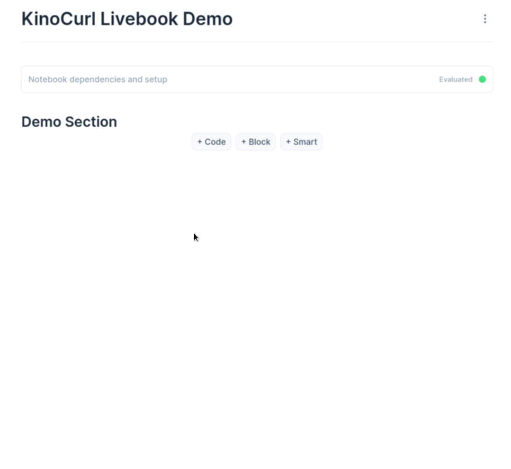

# KinoCurl [](https://github.com/open-status/kino_curl/actions/workflows/ci.yml) [](https://hex.pm/packages/kino_curl) [](https://hexdocs.pm/kino_curl/)

cURL integration with [Kino](https://github.com/livebook-dev/kino) for [Livebook](https://github.com/livebook-dev/livebook).
Automatically converts `curl` commands into executable Elixir code.



## Installation

To install KinoCurl in a Livebook, you can use `Mix.install/2`:

```elixir
Mix.install([
  {:kino_curl, "~> 0.1.0"}
])
```

## Notes

- [parse-curl.js](https://github.com/tj/parse-curl.js) is currently being used for parsing cURL commands including the flags/arguments.
- [ex_curl](https://github.com/open-status/ex_curl) is being used for executing requests using native libcurl code. This means libcurl must be present in the runtime environment.

